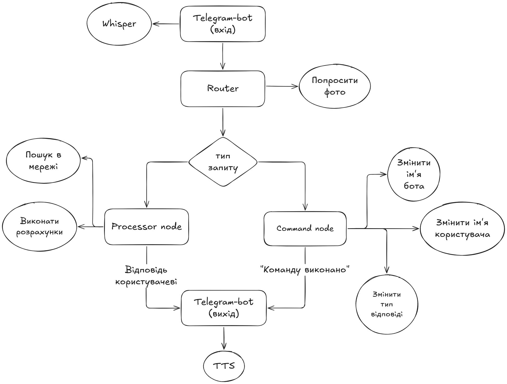

# Остап - ШІ-помічник для людей із вадами зору.

> **Статус: Заморожено (виконано все що було на меті)**

Telegram-бот із використанням великих мовних моделей, розроблений спеціально для людей із вадами зору. Остап розуміє голосові повідомлення, аналізує фотографії та відповідає голосом - без необхідності читати текст.

Наразі бот офлайн (28.04.2026). Проте, за потреби, я можу його ввімкнути. Напишіть на пошту
artem.kalchenko2004@gmail.com

## Можливості

- **Голосовий ввід** - розпізнавання мовлення через Whisper (підтримка української мови)
- **Аналіз зображень** - опис фото, розпізнавання об'єктів, тексту, навколишнього середовища
- **Голосові відповіді** - бот може генерувати голосові повідомлення за допомогою синтезу мовлення через Edge TTS (`uk-UA-OstapNeural`)
- **Пошук в інтернеті** - бот сам вирішує коли потрібна актуальна інформація
- **Текстовий режим** - для тих хто віддає перевагу тексту і використанню вбудованих screen reader-ів
- **Пам'ять розмови** - бот пам'ятає контекст попередніх повідомлень. Було впроваджено спеціальний спосіб збереження
  повідомлень в пам'яті, при якому економиться контекстне вікно і бот завжди пам'ятає найголовніші повідомлення: останню
  свою відповідь, останнє зображення, останнє питання користувача, останній пошук в мережі.
- **Голосове розпізнавання команд** - бот має LLM-модуль для розпізнавання команд, наприклад: змінити ім'я користувача,
  змінити ім'я бота, змінити тип виводу відповідей. Список може бути доповнений в майбутньому.
- **Покращення зображення** - бот має вбудовану систему, яка збільшує різкість зображення для покращення розпізнавання
  тексту
- **Виконання розрахунків** - якщо модель розуміє, що їй потрібно щось розрахувати вона викликає відповідний модуль:
  певна LLM, яка генерує код, після чого цей код запускається в безпечному середовищі й повертає результат операцій.

---

## Приклади використання

**Аналіз зображення:**
> Користувач надсилає фото упаковки і питає голосом:
> *"Що написано на цій упаковці?"*
>
> Бот відповідає голосом:
> *"На упаковці написано: Молоко ультрапастеризоване, 2.5% жирності, 1 літр. Виробник - Галичина."*

---

**Пошук інформації:**
> *"Яка сьогодні погода в Харкові?"*
>
> *"Сьогодні в Харкові хмарно, температура мінус три градуси, вітер слабкий."*

---

**Виконання команд:**
> *"Називай мене Наталя"*
>
> *"Добре, тепер я буду називати вас Наталя."*

> *"Тепер ти будеш Олег""*
> 
> *"Добре, тепер мене звуть Олег"*
---

**Інструкції з покращення фото** *(якщо фото нечітке)*:
> *"Фото трохи розмите. Спробуйте притримати телефон двома руками і не рухатись під час зйомки."*

---

## Технічний стек

| Компонент              | Технологія               |
|------------------------|--------------------------|
| Платформа              | Telegram Bot (aiogram 3) |
| LLM                    | OpenRouter               |
| Оркестрація            | LangChain                |
| Розпізнавання мовлення | Groq Whisper 3 large     |
| Синтез мовлення        | Microsoft Edge TTS       |
| Обробка аудіо          | ffmpeg                   |
| Хостинг                | fly.io                   |

> Але моделі легко змінюються, якщо потрібно
---

## Архітектура

---
